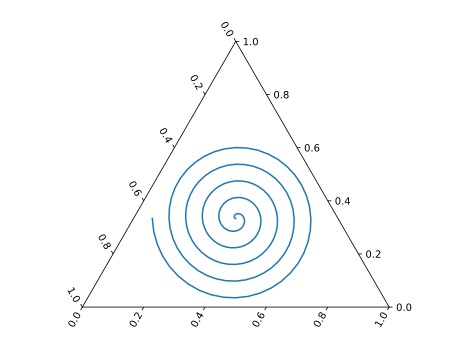

###########
Basic Usage
###########

Import mpltern as well as Matplotlib as:

.. code-block:: python

    import matplotlib.pyplot as plt
    import mpltern

By ``import mpltern``, a Matplotlib projection ``'ternary'`` is
registered inside.

Then, make ``TernaryAxes`` e.g. as:

.. code-block:: python

    ax = plt.subplot(projection='ternary')

It is already possible to create ternary plots using the methods in ``ax``.
For example:

.. code-block:: python

    from mpltern.ternary.datasets import get_spiral

    t, l, r = mpltern.datasets.get_spiral()
    # t: [0.33333333 0.33357906 0.33430414 ...]
    # l: [0.33333333 0.33455407 0.33543547 ...]
    # r: [0.33333333 0.33186687 0.33026039 ...]
    ax.plot(t, l, r)
    plt.show()

You may see the following Archimedean spiral in the triangle.

Contour-like plots are also possible in mpltern.

.. code-block:: python

    ax = plt.subplot(projection='ternary')

    from mpltern.ternary.datasets import get_shanon_entropies

    t, l, r, v = get_shanon_entropies()
    # t: [ 0. 0.  0.  0.  0.  0.  0.  0.  0.  0.  0.  0.1 0.1 0.1 ...]
    # l: [ 0. 0.1 0.2 0.3 0.4 0.5 0.6 0.7 0.8 0.9 1.  0.  0.1 0.2 ...]
    # r: [ 1. 0.9 0.8 0.7 0.6 0.5 0.4 0.3 0.2 0.1 0.  0.9 0.8 0.7 ...]
    # v: [-0. 0.32508297  0.50040242  ...]
    ax.tricontourf(t, l, r, v)
    plt.show()

.. image:: basic_2.svg

See `more examples in the gallery
<https://mpltern.readthedocs.io/en/latest/gallery/index.html>`__.

