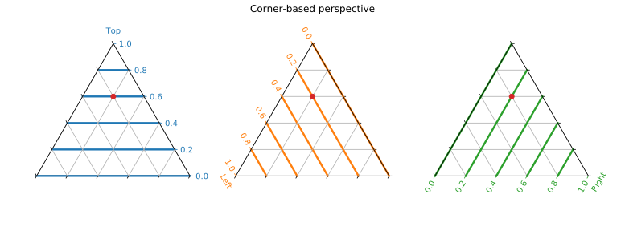

######################
Conventions in mpltern
######################

Axes and Ticks
==============

In a ternary plot, three variables which sum to a constant
``t + l + r = ternary_scale`` (= 1 in mpltern by default) are projected onto
a two-dimensional triangle.
Each variable is associated with each corner of the triangle, and the value is
represented by the scaled distance to the corner from its opposite side.

There may be two kinds of perspectives to read a ternary plot; the
"corner-based" and the "side-based" perspectives.
**Mpltern adopts the "corner-based" perspective.**
In this perspective, each of the three variables is associated with a corner of
the triangle, and the position in the triangle is given as the scaled distance
to the corner from its opposite side, as already written above.
In mpltern, the order of the variables is ``T (top) → L (left) → R (right)``
(counterclockwise).

In mpltern, by default, the ticks are shown to the right side of the triangle
with seeing the corresponding corner upward.
You can put the ticks to the opposite sides by ``ax.opposite_ticks(True)``.
Notice that, although the tick positions are changed, still a point in the
triangle corresponds to the same composition (see the red point).

.. image:: corner_based_2.svg

Some people read a ternary plot with the "side-based" perspective like the
figure below. In this perspective, we must also specify if the ticks proceed
in a clockwise or a counterclockwise manner.
*Be careful that, in the "side-based" perspective, a point in the triangle
corresponds to different compositions between the clockwise and the
counterclockwise tick progresses*, which may be confusing (see the red point).
This also means that a position for a side is not immediately associated with
the value of the corresponding variable in the "side-based" perspective.
To avoid such confusions, in mpltern, the "corner-based" perspective is
adopted.

.. image:: side_based_ccw.svg

.. image:: side_based_cw.svg

The discussions
`here <https://github.com/marcharper/python-ternary/issues/13>`__
and
`here <https://github.com/marcharper/python-ternary/issues/18>`__
may be also helpful to understand.

Convention in Other Software
============================

In the corner-based perspective, :doc:`existing codes <alternatives>` for ternary
plots give the following orders by default:

================ ========================= =========
 Code            Order of triangle corners Ticks
================ ========================= =========
 Plotly          ``T → L → R`` (CCW)       CW
 python-ternary  ``R → T → L`` (CCW)       CCW
 ggtern          ``L → R → T`` (CCW)       CCW
 Ternary (R)     ``T → R → L`` (CW)        CW
 d3-ternary      ``L → R → T`` (CCW)       CW
 PGFPlots        ``T → L → R`` (CCW)       CCW
 Veusz           ``R → L → T`` (CW)        CCW
 ternaryplot.com ``T → L → R`` (CCW)       CW
 Delta Plotware  ``T → R → L`` (CW)        CCW
 Dplot           ``R → T → L`` (CW)        CW
 Grapher         ``R → T → L`` (CCW)       CCW
 JMP             ``L → T → R`` (CW)        CW
 Origin          ``R → T → L`` (CCW)       CCW
 Statgraphics    ``T → L → R`` (CCW)       CCW
================ ========================= =========

In mpltern by default:

- ``T → L → R`` (CCW) for the order of triangle corners
- CCW for the ticks progress

Normalization in Ternary Plots
==============================

In most plotting methods in mpltern, the given three variables are
automatically normalized by ``ternary_scale``.
By this convention, the three variables can be treated on an equal footing.
The exceptions are the span-plots like ``ax.axtline``.
Since in these methods only one of the variables is given, in principle it is
not possible whether the given value is already normalized or not.
**To avoid confusions, it is strongly suggested to normalize the three
variables beforehand outside mpltern.**
