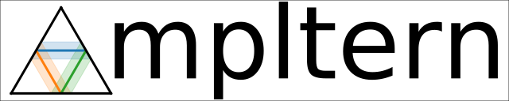

#########
|mpltern|
#########

.. title:: mpltern

.. _Matplotlib: https://matplotlib.org
.. _seaborn: https://seaborn.pydata.org
.. _Jupyter: http://jupyter.org

Mpltern is a Python plotting library based on Matplotlib_ specifically designed
for `ternary plots <https://en.wikipedia.org/wiki/Ternary_plot>`_.
Mpltern is implemented as a new projection for Matplotlib, with introducing
e.g. new ``Transform`` classes for ternary plots.
The followings are the features of mpltern when compared with other
ternary-plot libraties:

- Many things one expects essentially possible using Matplotlib can be done
  also in mpltern, without e.g. ternary-to-Cartesian conversions on the user
  side
- For the same plotting styles, mpltern offers the same or very similar method
  names as Matplotlib does; you do not need to learn many new commands in
  addition to those for Matplotlib
- Tick markers, tick labels, and axis labels are automatically positioned with
  reasonable paddings inherited from Matplotlib;
  this allows users e.g. faster production of ternary plots with publication
  quality
- Easy combination with normal Matplotlib plots
- Easy application of seaborn_ styles
- Working also in Matplotlib interactive modes inside e.g. Jupyter_ notebooks

.. raw:: html

   

      <a href="gallery/index.html">
         

         
         

         

         
         

         

         
         

         

         
         

      </a>
   

   

Citing mpltern
==============

At this moment, the author requests to cite the URL of this page if mpltern
contributes to a scientific publication.
Of course, `Matplotlib should be also very much acknowledged <https://matplotlib.org/citing.html>`_
when using mpltern.

DOIs
----

None yet.

Author
======

Yuji Ikeda
(`Github <https://github.com/yuzie007>`_,
`Google Scholar <https://scholar.google.co.jp/citations?user=2m5dkBwAAAAJ&hl=en>`_,
`ResearchGate <https://www.researchgate.net/profile/Yuji_Ikeda6>`_)
